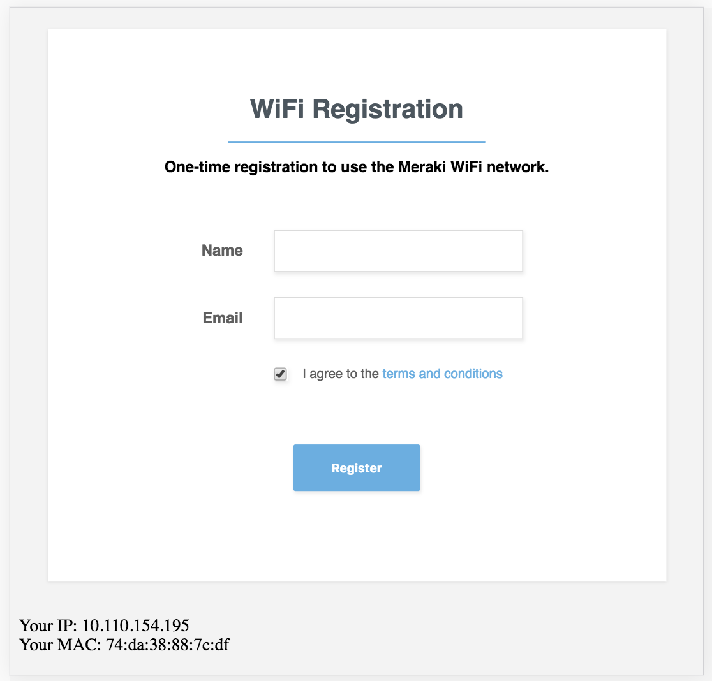

# Meraki Splash Page with Group Policies
A simple NodeJS applicaiton using Express with Handlebars



## Application Install

```
git clone <this repo> meraki
cd meraki
npm install
```
Open the `configs.sample.js` file and edit the variables and save the file as `configs.js`
```
//configs.js
// Rename this file to configs.js 
// Define your Application Configurations here
var config = {
    // Meraki API Key
    apiKey: "YourAPIKey", 
    // The "shard" number for your Meraki organization (find this in your dashboard URL)
    shard: "n###", 
    // The Meraki Network ID
    networkId: "YourNetworkID", 
    // The Meraki Group Policy ID 
    policy: "102"
}
```

```
npm start
```

View the site

http://localhost:3000

Test w/ sample moc data

http://localhost:3000/?base_grant_url=https%3A%2F%2Fn143.network-auth.com%2Fsplash%2Fgrant&user_continue_url=http%3A%2F%2Fask.com%2F&node_id=149624921787028&node_mac=88:15:44:50:0a:94&gateway_id=149624921787028&client_ip=10.110.154.195&client_mac=74:da:38:88:7c:df

## Meraki Setup
### Wireless SSID
Configure Wirless Network

Wireless --> Configure --> Access Control
- Splash Page: Click-through

### Splash Page Redirect
Wireless --> Configure --> Splash
- Custom Splash URL: http://YourPublicServerAddress:3000/

### Group Policy
Network-wide --> Configure --> Group Policies
- add Group
- Splash: Bypass


### Use Postman to get IDs
https://documenter.getpostman.com/view/897512/meraki-dashboard-prov-api/2To9xm#intro
- netID
- policyID


